# GameText Analyzer
### Benchmark modular de estratégias de paralelização aplicado à busca de palavras em textos literários

---

## Resumo

O **GameText Analyzer** é uma aplicação em Java desenvolvida para comparar o desempenho de diferentes estratégias de busca/contagem de palavras em arquivos `.txt`. O trabalho utiliza as amostras obrigatórias fornecidas na atividade: **Don Quixote**, **Dracula** e **Moby Dick**, e executa benchmarks entre métodos seriais, paralelos em CPU e paralelos em GPU/OpenCL.

Para manter uma conexão com jogos digitais, as obras foram interpretadas como **mundos narrativos** que poderiam servir de base para adaptações em jogos:

| Obra | Interpretação gamificada | Palavra-tema analisada |
|---|---|---|
| **Don Quixote** | RPG de Cavalaria e Aventura | `quijote` |
| **Dracula** | Survival Horror Gótico | `blood` |
| **Moby Dick** | Aventura Naval / Boss Hunt | `whale` |

A partir dessas amostras, o projeto compara abordagens como `SerialCPU`, `ParallelCPU`, `ParallelStream`, `ForkJoin`, `Virtual Threads`, `GPU String` e `GPU Hash`. Os resultados são registrados em CSV e visualizados em gráficos, permitindo analisar tempo de execução, speedup, eficiência paralela, impacto do número de threads, granularidade dos chunks, thresholds do ForkJoin e overhead da GPU.

---

## Introdução

A busca por eficiência computacional é essencial em aplicações que processam grandes volumes de dados. Em jogos digitais, textos e logs podem ser analisados para identificar padrões narrativos, frequência de eventos, recorrência de personagens, elementos de mundo e temas centrais. Neste trabalho, essa ideia foi adaptada para as amostras obrigatórias, interpretando cada obra literária como um possível universo de jogo.

O objetivo técnico é comparar diferentes formas de realizar a mesma tarefa: **contar a ocorrência de uma palavra em um texto**. A tarefa é simples o suficiente para permitir comparação clara entre métodos, mas também interessante para observar quando o paralelismo compensa ou quando o overhead de paralelização prejudica o desempenho.

A aplicação foi estruturada como um **framework modular de benchmark**. Todas as estratégias implementam uma interface comum (`WordCounter`) e são registradas em `StrategyRegistry`. Dessa forma, novos métodos podem ser adicionados sem alterar a lógica principal do benchmark, do CSV ou da geração de gráficos.

---

## Métodos implementados

### Estratégias seriais

| Método | Descrição |
|---|---|
| `SerialCPU` | Percorre o vetor de palavras com um loop simples. É o baseline principal. |
| `SerialStream` | Usa `Arrays.stream(...)` em modo sequencial, permitindo comparar loop manual com Stream API. |

### Estratégias paralelas em CPU

| Método | Descrição |
|---|---|
| `ParallelCPU-2t` | Divide o vetor entre 2 threads tradicionais. |
| `ParallelCPU-4t` | Divide o vetor entre 4 threads tradicionais. |
| `ParallelCPU-8t` | Divide o vetor entre 8 threads tradicionais. |
| `ParallelCPU-Nt` | Usa `Runtime.getRuntime().availableProcessors()` para definir o número de threads dinamicamente. |
| `ParallelCPU-8t-32chunks` | Usa 8 threads e 32 chunks fixos para testar granularidade. |
| `ParallelCPU-8t-128chunks` | Usa 8 threads e 128 chunks fixos. |
| `ParallelCPU-8t-dynChunks` | Calcula dinamicamente a quantidade de chunks de acordo com o tamanho do texto. |

### Estratégias com ForkJoin, Stream paralela e Virtual Threads

| Método | Descrição |
|---|---|
| `ForkJoinCPU-th2000` | Usa ForkJoin com threshold fixo de 2.000 palavras. |
| `ForkJoinCPU-th10000` | Usa ForkJoin com threshold fixo de 10.000 palavras. |
| `ForkJoinCPU-dyn` | Calcula threshold dinâmico conforme o tamanho da entrada. |
| `ParallelStream` | Usa `Arrays.stream(...).parallel()`, baseado no ForkJoinPool comum da JVM. |
| `VirtualThreads-50chunks` | Divide o trabalho em 50 chunks executados por virtual threads. |
| `VirtualThreads-100chunks` | Testa granularidade maior com 100 chunks. |

### Estratégias em GPU/OpenCL

| Método | Descrição |
|---|---|
| `ParallelGPU-String` | Envia o texto como bytes, offsets e tamanhos, e compara a palavra caractere por caractere no kernel OpenCL. |
| `ParallelGPU-Hash` | Converte cada palavra para `hashCode + length`, tornando a comparação na GPU uma operação numérica mais simples. |

A versão `ParallelGPU-String` foi mantida por ser mais próxima da comparação textual exata. A versão `ParallelGPU-Hash` foi adicionada como otimização experimental, reduzindo a complexidade da comparação no kernel. Como hashes podem ter colisões teóricas, o tamanho da palavra também é comparado para reduzir o risco de falso positivo.

---

## Metodologia

### Amostras obrigatórias

As amostras oficiais utilizadas no benchmark ficam em:

```text
data/samples/
```

| Arquivo | Obra | Mundo narrativo | Palavra buscada |
|---|---|---|---|
| `DonQuixote-388208.txt` | Don Quixote | RPG de Cavalaria e Aventura | `quijote` |
| `Dracula-165307.txt` | Dracula | Survival Horror Gótico | `blood` |
| `MobyDick-217452.txt` | Moby Dick | Aventura Naval / Boss Hunt | `whale` |

Essas obras atendem aos requisitos de variar o **tamanho** e a **natureza** das entradas: são textos literários diferentes, com volumes diferentes e temáticas distintas.

### Tokenização

Como as amostras são textos literários completos, o programa realiza uma etapa de tokenização antes do benchmark. Essa etapa:

- converte o texto para minúsculas;
- remove pontuação;
- remove acentos;
- divide o texto em palavras;
- ignora espaços e linhas vazias.

A tokenização acontece antes da medição principal. Assim, os tempos registrados nos gráficos representam principalmente o custo da **contagem em memória**, e não o tempo de leitura do disco.

### Medição de tempo

O tempo é medido com:

```java
System.nanoTime()
```

O valor é convertido para milissegundos com casas decimais. Essa escolha é mais adequada para benchmark do que `System.currentTimeMillis()`, pois permite medir intervalos muito pequenos com maior precisão.

Cada estratégia é executada **3 vezes**, após um warmup descartado. Os gráficos usam principalmente a **mediana**, pois ela reduz o impacto de variações pontuais.

### Métricas coletadas

| Métrica | Descrição |
|---|---|
| Ocorrências | Quantidade de vezes que a palavra buscada apareceu no texto. |
| Tempo de execução | Tempo da contagem em milissegundos. |
| Speedup | `tempo_serial / tempo_metodo`. Indica quantas vezes o método foi mais rápido que o serial. |
| Eficiência paralela | `speedup / número_de_threads`. Mede o aproveitamento do paralelismo. |
| Throughput | `total_de_palavras / tempo_ms`. Mede palavras processadas por milissegundo. |
| Preparation time | Tempo de preparação de dados, usado principalmente na GPU. |
| Kernel time | Tempo de execução/leitura associado ao kernel OpenCL. |

O CSV gerado fica em:

```text
results/resultados.csv
```

E possui colunas como:

```csv
file,world,total_words,word_searched,strategy_id,method,family,parallelism,run,occurrences,time_ms,preparation_ms,kernel_ms,speedup,efficiency,words_per_ms,is_real_gpu
```

---

## Resultados e discussão

Os resultados abaixo foram gerados a partir do CSV atual do projeto. Os valores podem variar em outra máquina, principalmente nas estratégias que usam `availableProcessors()` e GPU/OpenCL.

### 1. Comparação direta entre métodos

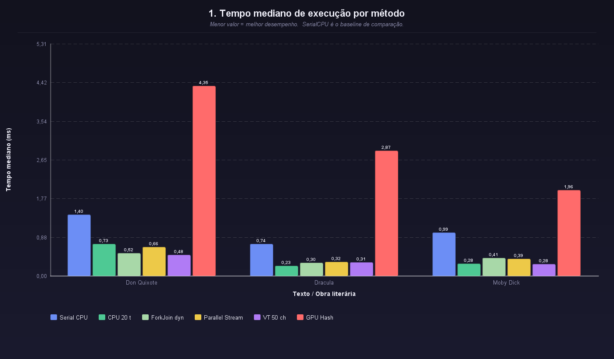

O gráfico de tempo mediano mostra que o `SerialCPU` funciona como uma referência estável, mas não é o método mais rápido. As melhores estratégias foram, em geral, variações paralelas em CPU, especialmente `ParallelCPU-20t`, `ParallelCPU-8t-dynChunks`, `ForkJoinCPU-th10000` e `VirtualThreads-50chunks`, dependendo da obra analisada.

A GPU, principalmente na versão `GPU String`, apresentou tempos maiores. Isso indica que, para a busca textual direta, o custo de preparação e transferência de dados para OpenCL pode superar o ganho obtido com paralelismo massivo.

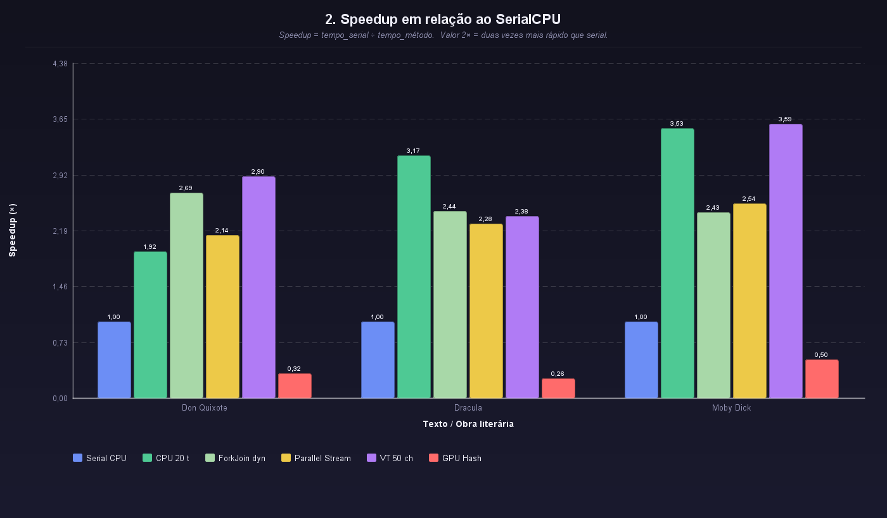

O gráfico de speedup reforça essa conclusão. Em algumas amostras, as estratégias paralelas em CPU alcançaram speedup superior a 3x em relação ao `SerialCPU`. Na execução registrada no CSV atual, os melhores resultados por obra foram:

| Obra | Melhor método | Tempo mediano | Speedup aproximado |
|---|---:|---:|---:|
| Don Quixote | `ForkJoinCPU-th10000` | 0,3891 ms | 3,48x |
| Dracula | `ParallelCPU-20t` | 0,1825 ms | 4,83x |
| Moby Dick | `ParallelCPU-8t-dynChunks` | 0,2016 ms | 4,04x |

Esses resultados mostram que o paralelismo em CPU foi efetivo, mas que o melhor método variou conforme o tamanho e a distribuição do texto.

---

### 2. Impacto do número de threads

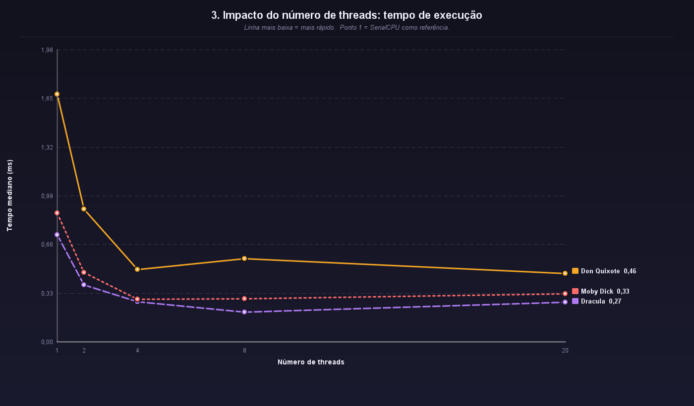

O gráfico de threads mostra que aumentar o número de threads tende a reduzir o tempo até certo ponto, mas o ganho não é perfeitamente linear. Em algumas obras, o uso de mais threads melhora bastante; em outras, a queda de tempo é menor.

Isso acontece porque, além do trabalho útil de contagem, existe overhead de divisão de tarefas, criação/gerenciamento de threads, escalonamento e acesso concorrente à memória.

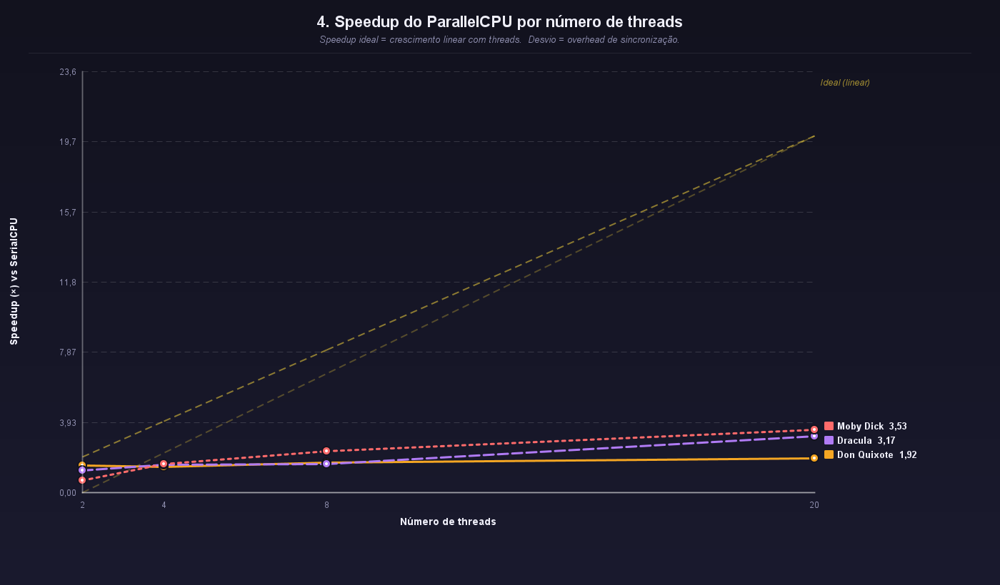

O speedup por número de threads mostra que o ganho cresce com o paralelismo, mas fica muito abaixo da linha ideal. Essa diferença entre o speedup real e o ideal é esperada em sistemas paralelos, pois nem toda parte da execução é perfeitamente paralelizável.

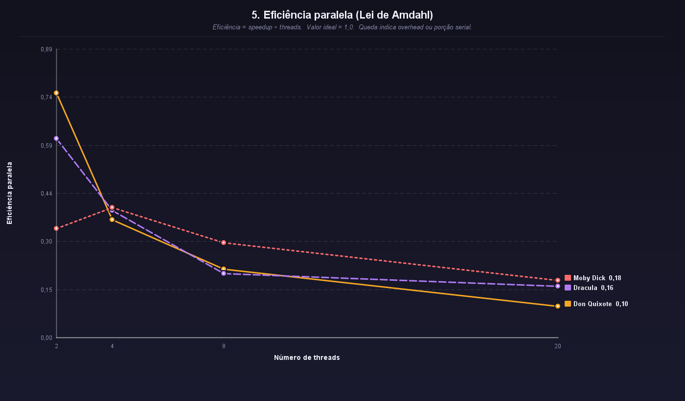

A eficiência paralela cai conforme o número de threads aumenta. Esse comportamento está relacionado à **Lei de Amdahl**: mesmo que parte do problema seja paralelizável, sempre há custos sequenciais e overheads que limitam o ganho total. Portanto, mais threads nem sempre significam aproveitamento proporcional.

---

### 3. Impacto do tamanho do texto

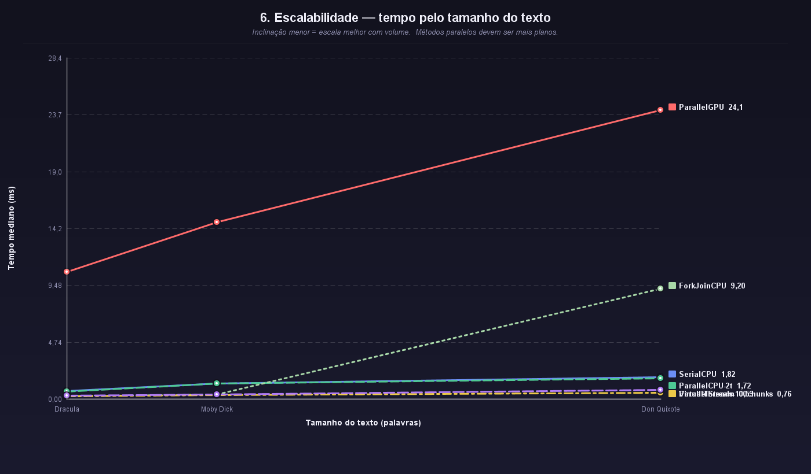

O gráfico de escalabilidade ordena os textos pelo tamanho em palavras. Ele permite observar como o tempo mediano cresce conforme o volume de entrada aumenta. Os métodos paralelos mais eficientes mantêm uma inclinação menor, indicando melhor escalabilidade.

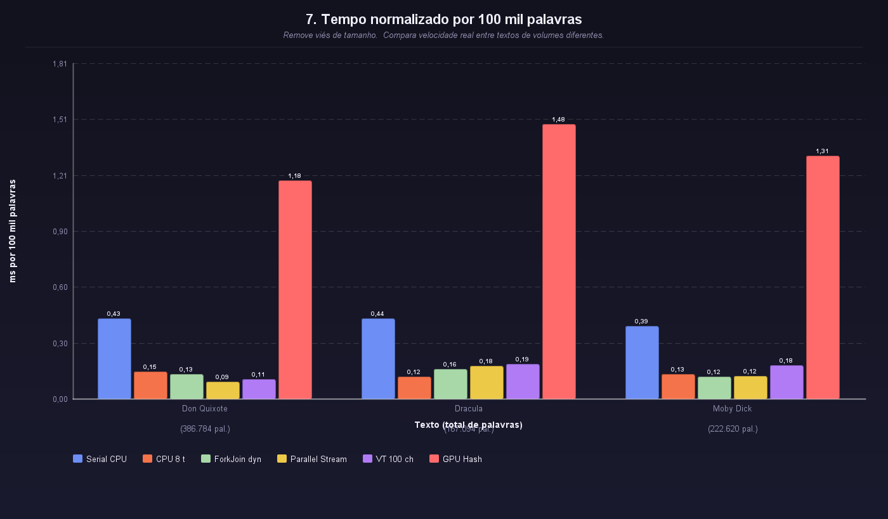

O tempo normalizado por 100 mil palavras remove parte do viés causado pelo tamanho diferente das obras. Ele mostra o custo relativo de cada método para processar volumes comparáveis de palavras. Essa métrica é especialmente útil porque os textos obrigatórios possuem tamanhos diferentes.

---

### 4. Estabilidade das execuções

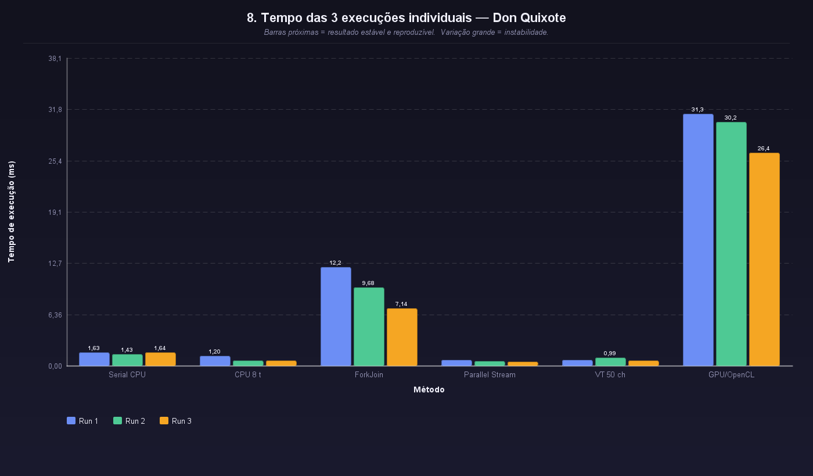

O enunciado exige pelo menos 3 execuções por método. Este gráfico mostra as três medições individuais e permite observar a estabilidade do benchmark. Barras próximas indicam resultados mais reprodutíveis; variações maiores indicam influência de ruído, escalonamento da JVM ou custos variáveis de execução.

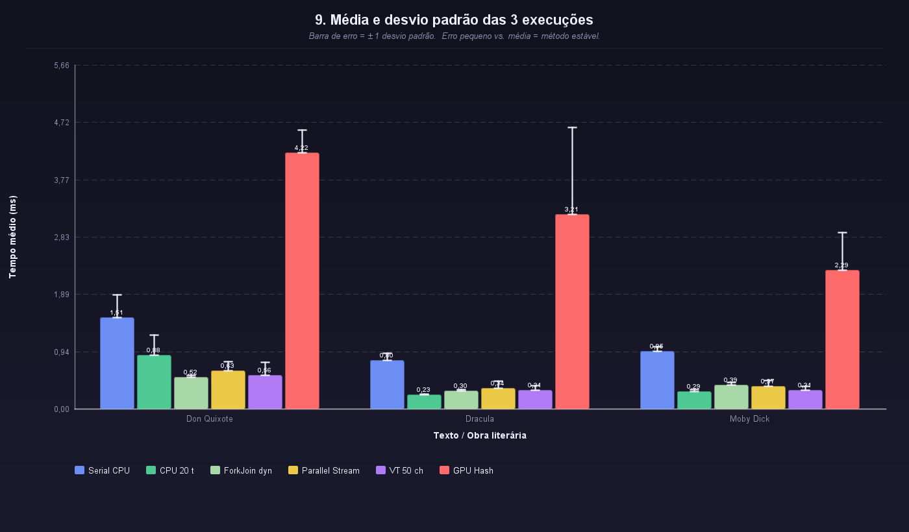

A média com desvio padrão complementa a mediana. Métodos com barras de erro pequenas apresentaram comportamento mais estável. Em métodos com maior overhead, como algumas estratégias de GPU, o desvio pode ser maior, indicando maior variação entre execuções.

---

### 5. Granularidade do paralelismo

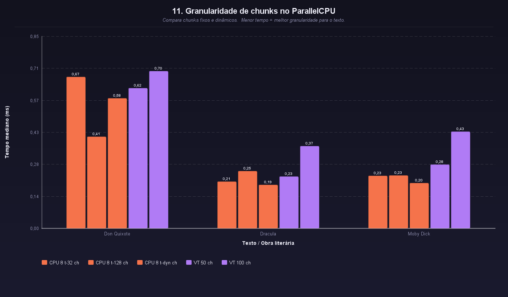

Este gráfico compara versões com chunks fixos e dinâmicos. A granularidade influencia diretamente o desempenho: chunks pequenos podem melhorar o balanceamento, mas também aumentam o número de tarefas; chunks grandes reduzem overhead, mas podem desperdiçar paralelismo.

A versão dinâmica tenta encontrar um equilíbrio entre esses extremos, calculando a divisão conforme o tamanho do texto. Na execução atual, essa abordagem foi especialmente competitiva em `Moby Dick`.

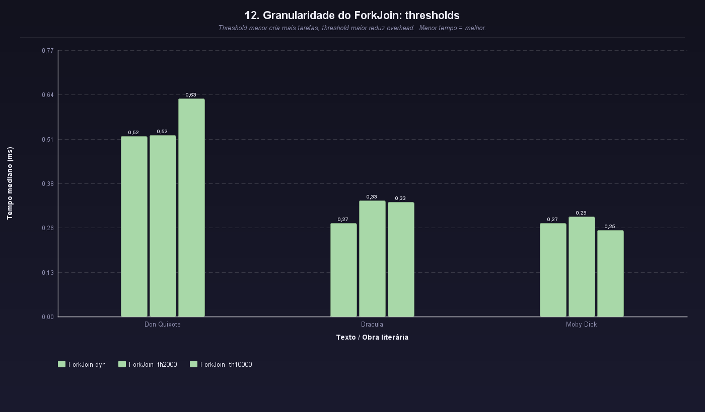

O ForkJoin também depende de granularidade, representada pelo threshold. Thresholds menores criam mais subtarefas recursivas; thresholds maiores reduzem a quantidade de tarefas, mas podem limitar o paralelismo. Os resultados mostram que não existe um threshold universalmente melhor para todas as obras.

Esse comportamento reforça a importância de testar estratégias diferentes em vez de assumir que uma única configuração será ideal.

---

### 6. GPU/OpenCL: string versus hash

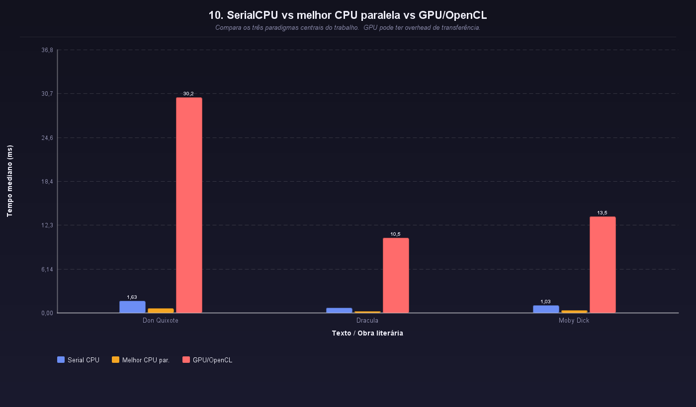

A comparação entre CPU e GPU mostra que a GPU não superou as melhores estratégias paralelas em CPU nas amostras analisadas. No entanto, a versão `GPU Hash` melhorou significativamente em relação à `GPU String`.

Isso acontece porque a `GPU String` precisa comparar caracteres, offsets e tamanhos variáveis, enquanto a `GPU Hash` transforma a busca em uma comparação numérica (`hashCode + length`). Essa forma é mais adequada ao modelo de execução da GPU, que favorece operações simples, uniformes e massivamente paralelas.

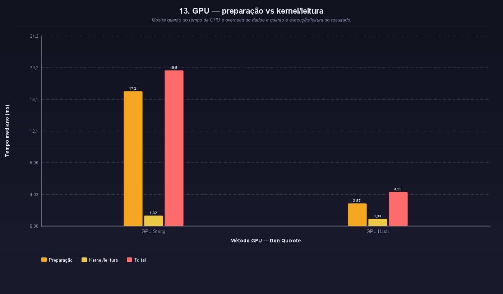

A decomposição do tempo da GPU mostra que grande parte do custo está na preparação dos dados, especialmente na versão `GPU String`. No caso da `GPU Hash`, a preparação fica menor, e a comparação no kernel também se torna mais simples.

Mesmo assim, a GPU ainda precisa lidar com custos de transferência de dados, criação de buffers e leitura dos resultados. Como as amostras obrigatórias não são extremamente grandes para padrões de GPU, esse overhead não foi amortizado o suficiente para superar a CPU paralela.

---

### 7. Resumo final dos melhores métodos

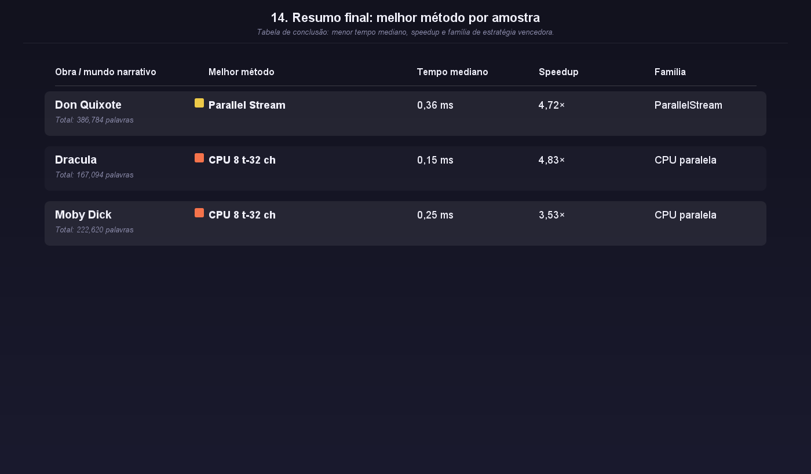

O gráfico-resumo mostra o melhor método em cada obra, seu tempo mediano, speedup e família. Ele é útil para a conclusão porque evidencia que o vencedor não foi sempre o mesmo. O desempenho dependeu da interação entre tamanho do texto, estratégia de paralelização, granularidade e overhead.

---

## Conclusão

O **GameText Analyzer** cumpre o objetivo do trabalho ao comparar algoritmos seriais, paralelos em CPU e paralelos em GPU/OpenCL para busca de palavras em textos. A aplicação utiliza as amostras obrigatórias, registra os resultados em CSV, executa pelo menos três medições por método e gera gráficos para análise estatística e visual.

A principal conclusão é que o paralelismo em CPU foi o mais vantajoso para as amostras analisadas. Estratégias como `ParallelCPU`, `ParallelStream`, `ForkJoin` e `VirtualThreads` reduziram o tempo de execução em relação ao `SerialCPU`, mas o ganho não foi linear. O número de threads, a granularidade dos chunks e o threshold do ForkJoin influenciaram diretamente o desempenho.

A GPU/OpenCL foi tecnicamente implementada e comparada em duas versões: `GPU String` e `GPU Hash`. A versão por hash melhorou o desempenho por transformar a busca textual em comparação numérica, mas ainda não superou as melhores estratégias em CPU. Isso sugere que, para este problema e para o volume das amostras obrigatórias, o overhead de preparação, transferência e leitura da GPU foi maior que o benefício do paralelismo massivo.

Assim, o trabalho demonstra que **paralelizar não significa automaticamente acelerar**. A escolha da melhor estratégia depende do tamanho da entrada, da natureza da operação, da granularidade das tarefas, do ambiente de execução e do custo de comunicação entre CPU e GPU.

---

## Como executar

### Pré-requisitos

- Java 21 ou superior;
- `javac` no PATH;
- arquivos das amostras em `data/samples/`;
- opcionalmente, driver OpenCL instalado para execução real da GPU;
- `jocl-2.0.4.jar` em `lib/` para suporte JOCL.

### Executar interface gráfica

```bash
chmod +x build.sh
./build.sh
```

### Executar modo console

```bash
./build.sh --console
```

### Compilar manualmente

```bash
find src/main/java -name "*.java" | xargs javac --release 21 -d out -cp "out:lib/*"
java -cp "out:lib/*" gamelog.Main
```

---

## Estrutura do projeto

```text
GameTextAnalyzer/
├── src/main/java/gamelog/
│   ├── Main.java
│   ├── SampleConfig.java
│   ├── CsvReader.java
│   ├── benchmark/
│   │   ├── BenchmarkRunner.java
│   │   ├── BenchmarkResult.java
│   │   └── CsvWriter.java
│   ├── counters/
│   │   ├── WordCounter.java
│   │   ├── StrategyFamily.java
│   │   ├── StrategyRegistry.java
│   │   ├── SerialCPUCounter.java
│   │   ├── SerialStreamCounter.java
│   │   ├── ParallelCPUCounter.java
│   │   ├── ChunkedParallelCPUCounter.java
│   │   ├── ForkJoinCPUCounter.java
│   │   ├── ParallelStreamCounter.java
│   │   ├── VirtualThreadCounter.java
│   │   ├── ParallelGPUCounter.java
│   │   └── ParallelGPUHashCounter.java
│   ├── ui/
│   │   ├── MainWindow.java
│   │   ├── BenchmarkPanel.java
│   │   ├── ChartsPanel.java
│   │   ├── ChartGenerator.java
│   │   └── ...
│   └── utils/
│       └── FileUtils.java
├── data/samples/
├── results/resultados.csv
├── charts/
├── lib/
│   ├── flatlaf-3.5.4.jar
│   └── jocl-2.0.4.jar
└── build.sh
```

---

## Observações sobre GPU/OpenCL

Para que os métodos GPU sejam executados de verdade, é necessário que a máquina possua OpenCL configurado corretamente. O projeto utiliza JOCL como ponte entre Java e OpenCL.

Requisitos para GPU real:

- driver OpenCL instalado;
- dispositivo compatível com OpenCL;
- `jocl-2.0.4.jar` no classpath;
- bibliotecas nativas necessárias disponíveis no sistema.

Caso o ambiente não suporte OpenCL, o projeto pode usar fallback em CPU, identificado no nome do método e no CSV. Apenas resultados com `is_real_gpu = true` devem ser interpretados como execução real em GPU/OpenCL.

---

## Referências

- Java ExecutorService Documentation: https://docs.oracle.com/en/java/javase/21/docs/api/java.base/java/util/concurrent/ExecutorService.html
- Java Virtual Threads Documentation: https://docs.oracle.com/en/java/javase/21/core/virtual-threads.html
- Java System.nanoTime Documentation: https://docs.oracle.com/en/java/javase/21/docs/api/java.base/java/lang/System.html#nanoTime()
- JOCL - Java bindings for OpenCL: https://github.com/gpu/JOCL
- OpenCL Specification - Khronos Group: https://www.khronos.org/opencl/
- Amdahl, G. M. *Validity of the Single Processor Approach to Achieving Large Scale Computing Capabilities*. AFIPS, 1967.

---

## Anexos

Os códigos-fonte completos estão disponíveis em `src/main/java/gamelog/`.

> **Link do projeto no GitHub:** https://github.com/raquelx99/GameTextAnalyzer  
> Substituir pelo link real antes da entrega.
